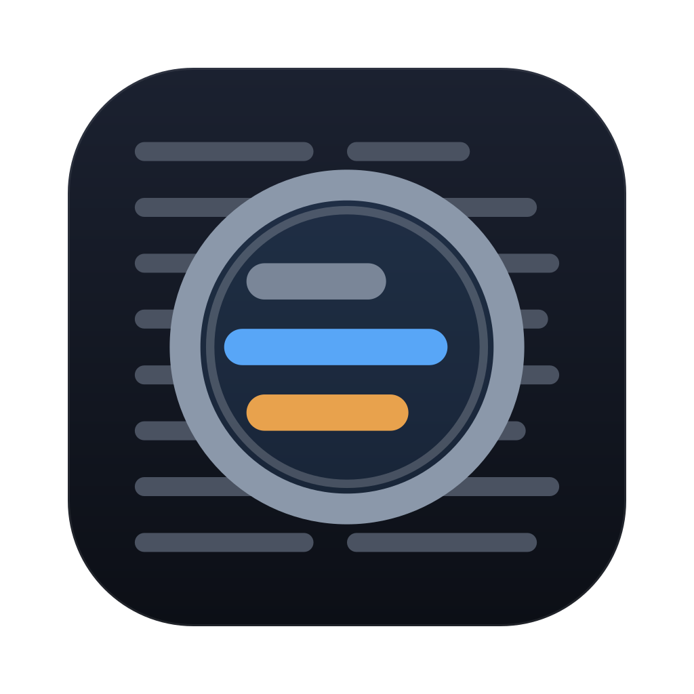
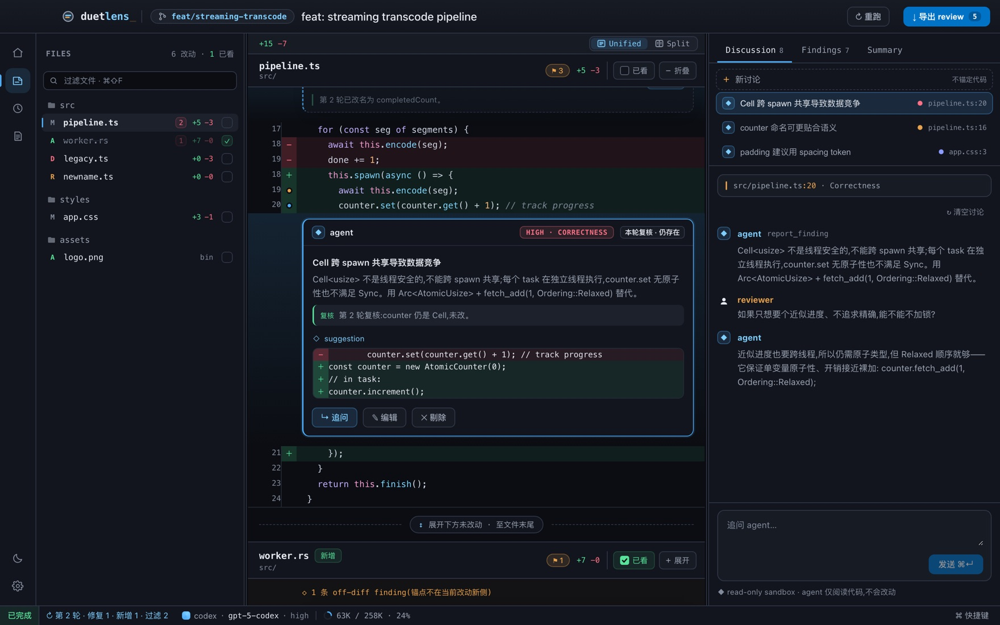
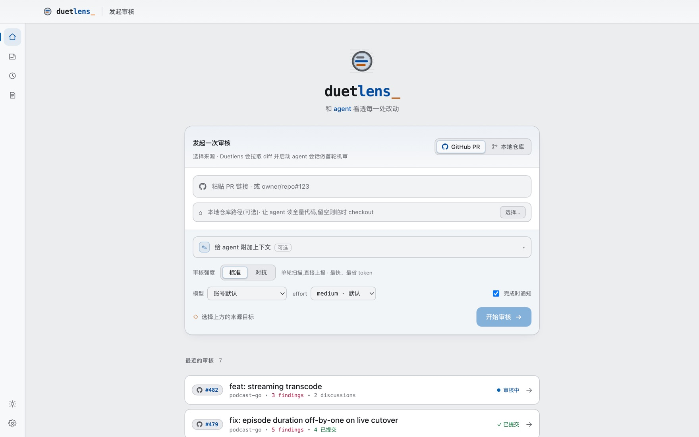
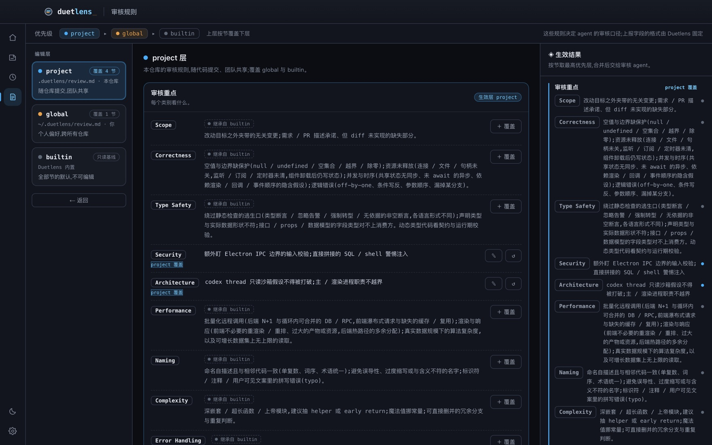
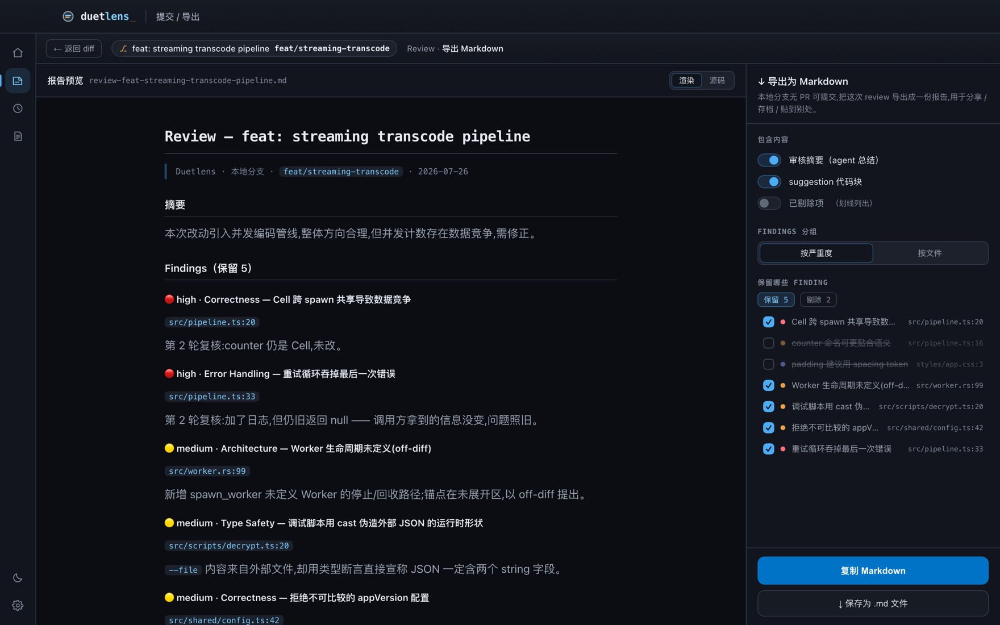

<p align="center">
  
</p>

<h1 align="center">Duetlens</h1>

<p align="center">和 agent 看透每一处改动</p>

<p align="center">
  <a href="https://github.com/xieziyu/duetlens/releases/latest"></a>
  <a href="LICENSE"></a>
  
  
</p>

<p align="center">
  简体中文 · <a href="README.en.md">English</a>
</p>

Duetlens 是一个 macOS 桌面应用:把一次 code review 变成你和 codex agent 的**双人对话**,而不是读一份机审报告。

agent 扫出的每条 finding 都是一个可以继续追问的讨论线程;你也可以在 diff 的任意一行、任意一段代码上直接开口问 —— 为什么这么写、这个取舍的代价是什么、这里会不会有并发问题。看完之后筛一遍,提交成 GitHub PR review,或导出一份 Markdown。



## 功能

**在 diff 上对话,而不是读报告。** findings 不是终点而是锚点:每条背后挂着一个常驻会话里的讨论,可以一直追问下去。行内 ✎ 或框选一段代码就在原地开一条新讨论;问架构、问整体取舍这类不落在某一行上的问题,也可以不锚定代码直接问。

**记 finding 是提问的加法。** 同一张卡,打开 `⚑ 记为 finding` 就地长出 severity / category / 标题 / suggestion,不用先决定"我这是要提问还是要记问题"。

**多轮复审,你的处置不会被推翻。** 每轮换一个新会话全量重扫,并要求 agent 对上一轮每条 finding 明确表态 `fixed` / `wont_fix` / `still_present`;你剔除过的项经提示词与去重两层抑制,不会又冒出来。

**只审,不改。** agent 跑在 read-only sandbox 里,没有"让它顺手修一下"这个选项。`suggestion` 只作为提给作者的 GitHub suggestion 块。

**三种来源。** GitHub PR(粘贴链接即解析)、本地 git 分支、GitButler 虚拟分支。本地仓库那一档由仓库当前状态自动判定走哪条。

**两档强度。** 标准档单轮扫描直接上报;对抗档在同一会话里追加一轮自检,补漏并给存疑结论降级 —— 更贵,但更少臆测。



**审核规则三层覆盖。** `builtin` ▸ `~/.duetlens/review.md`(个人) ▸ `.duetlens/review.md`(随仓库提交,团队共享),按节独立覆盖,右栏常驻显示合并后的生效结果。



**提交或导出。** 筛一遍 findings,提交成 GitHub PR review(inline 评论 + suggestion 块);本地分支没有 PR 可提交,就导出成一份 Markdown 报告。



还有:审核历史存本地 sqlite(保留 30 天)· 明暗与配色两个正交轴(含一套 GitHub 配色)· `⌘F` 找内容 / `⌘⇧F` 找文件 · unified / split 双视图 · per-file 已看标记 · 完成时系统通知。

## 安装

### 前置

- macOS,Apple Silicon
- [codex CLI](https://github.com/openai/codex) 并已 `codex login` —— 审核 agent 建立在 `codex app-server` 之上(在 0.144.x / 0.145 实测)
- 可选 [`gh`](https://cli.github.com) 并已 `gh auth login` —— 只有 GitHub PR 来源与提交 review 需要
- 可选 [GitButler](https://gitbutler.com) 的 `but` —— 只有虚拟分支来源需要

首次启动会逐项自检这些前置,缺什么给可复制的修复命令,不是直接抛一句错。

### 下载

从 [最新 Release](https://github.com/xieziyu/duetlens/releases/latest) 拿 `.dmg`,拖进 Applications。后续版本由应用内自动更新接手。

同一页里的 `.zip` 是给自动更新用的,手动安装不需要。

### 从源码运行

```bash
npm ci
npm run rebuild:electron   # better-sqlite3 按 Electron ABI 重编
npm start
```

出一个自用的本地包:`npm run package`(ad-hoc 签名,只能在本机跑)。正式包由 CI 在推 `v<version>` tag 时签名 + 公证。

## 用起来

1. 入口选来源 —— 粘一个 PR 链接,或选一个本地仓库和分支。
2. 开始审核:Duetlens 拉 diff、起一个常驻 codex 会话跑首轮机审。findings 经 MCP 工具回传,边扫边落到 diff 上,不用等扫完。
3. 追问、triage、自己补 finding。想换个强度或换个模型再看一遍,就重跑一轮。
4. GitHub PR 提交 review;本地分支导出 Markdown。

每一轮机审都在花你 codex 账号的额度,底部状态栏常驻显示模型、effort 和上下文用量。

## 设计与文档

设计目标、已拍板的决策及其理由在 [docs/README.md](docs/README.md);工程约定在 [CLAUDE.md](CLAUDE.md)。

技术栈:Electron + React + TypeScript,后端写在 main 进程;审核 agent 是 codex app-server 的常驻 JSON-RPC 会话;findings 走进程内自托管的 HTTP MCP server 回传;本地存储 better-sqlite3。

Duetlens 是 [better-review](https://github.com/xieziyu/better-review) 的 2.0 全重写。1.0 是单向、一次性的:一次 `codex exec` 跑完、写出 `findings.json` 就结束,人只能消费结果。要能追问,agent 会话就必须常驻 —— 这也是重写的起点。

## 反馈

Bug 与需求走 [Issues](https://github.com/xieziyu/duetlens/issues)。应用内"设置 → 关于"里的反馈入口会带上环境信息预填一份。

## License

[GPL-3.0-or-later](LICENSE)
