# 线框与状态机

> 返回 [文档索引](../README.md)
>
> 状态:从稳定的 mockup 反抽屏级流转与组件状态机,为实现期的组件层([frontend-components](frontend-components.md))与状态持久化铺路。

[`ui.md`](ui.md) 描述每个屏和状态的**视觉与交互**,mockup(`mockup/*.html`)是像素级线框来源。本篇只做一件事:把散在 mockup / ui.md 里的**状态与流转**收敛成一组状态机,让实现期能一眼看清「有哪些状态、由什么事件驱动、迁移到哪」。视觉细节仍以 mockup 为准,不在此重复。

约定:状态机用 mermaid `stateDiagram-v2`;`◆` = agent 侧事件,`●` = 用户操作,`⚙` = 后端/codex 事件。

## 屏级流转

三个顶层屏:**entry**(launcher)→ **review**(diff 主场)→ 二选一出口 **submit-to-github** 或 **export-markdown**。出口由 source 决定:`github-pr` 走提交 PR review,`local-branch` / `gitbutler-vbranch` 无 PR,走本地 Markdown 导出。

```
mockup/entry.html          mockup/diff-review.html         mockup/submit-to-github.html
┌──────────────┐  开始审核   ┌───────────────────────────┐  提交 review  ┌──────────────┐
│  hero        │ ─────────▶ │ scan  →  discussion/       │ ───────────▶ │ 组织 PR review│
│  发起审核卡片 │            │          findings/summary  │  (github-pr) │  评论 + event │
│  最近的审核   │ ◀───────── │                           │              └──────────────┘
└──────────────┘  返回/新建  │  三栏:tree │ diff │ tabs   │  导出 md      mockup/export-markdown.html
                            └───────────────────────────┘ ───────────▶ ┌──────────────┐
                                                          (local/vbranch)│ 预览 + 配置   │
                                                                         │ 复制/保存 .md │
                                                                         └──────────────┘
```

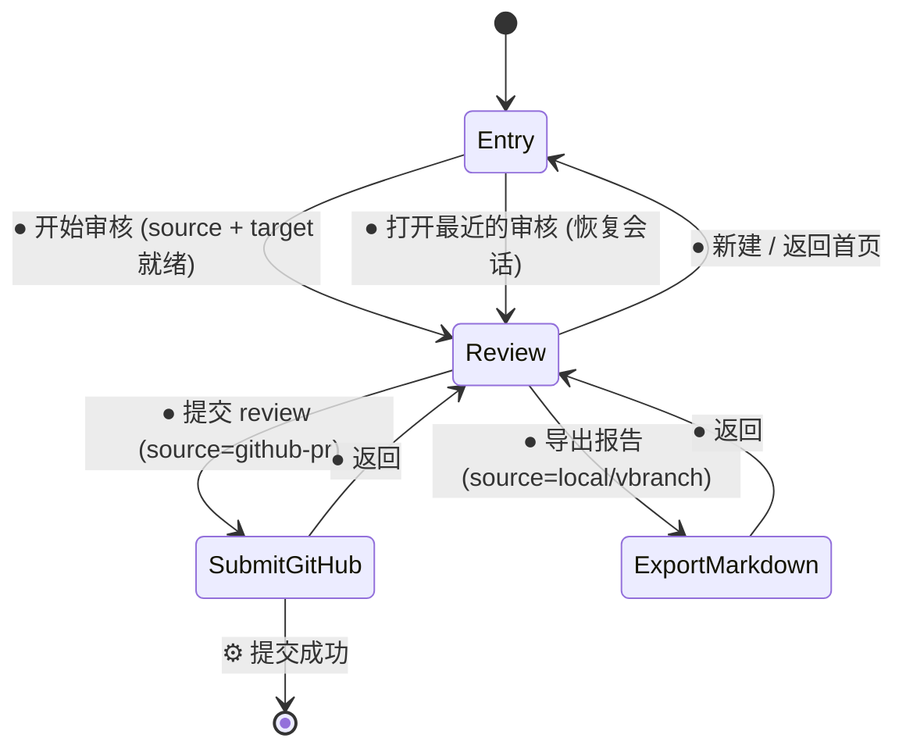

「最近的审核」直接把历史会话恢复进 review 屏(不单开历史页),因此 `Entry → Review` 有两条入边:新建与恢复。

## Review 生命周期:scan → reviewing

进入 review 屏后先跑**首轮机审**(scan),扫描态即右栏初始态(否决 overlay),扫完自动切到 Discussion/Findings。scan 期间左侧 diff 全程可读、可点 finding、可框选提问。

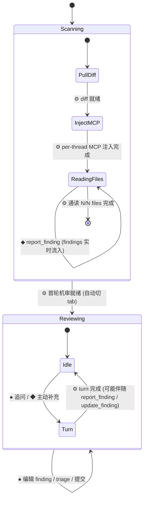

顶栏 `扫描中 / 已完成` demo 开关对应 `Scanning ↔ Reviewing` 两态(mockup 里手动切换以演示)。scan 的四个子步是右栏纵向 timeline 的 `pending → active → done` 序列(见下)。

### Scan timeline 单步

timeline 每一步(拉 diff / 注入 MCP / 通读 files / 就绪)独立走三态:

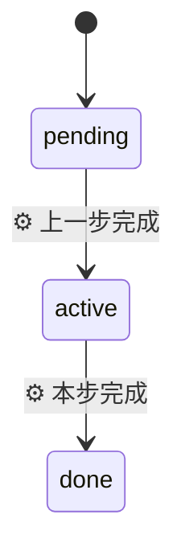

## 右栏 tab

Discussion / Findings / Summary 三 tab 互斥;键盘 `1/2/3` 直切(见 ui.md 键盘快捷键)。scan 结束后默认落在 Discussion。

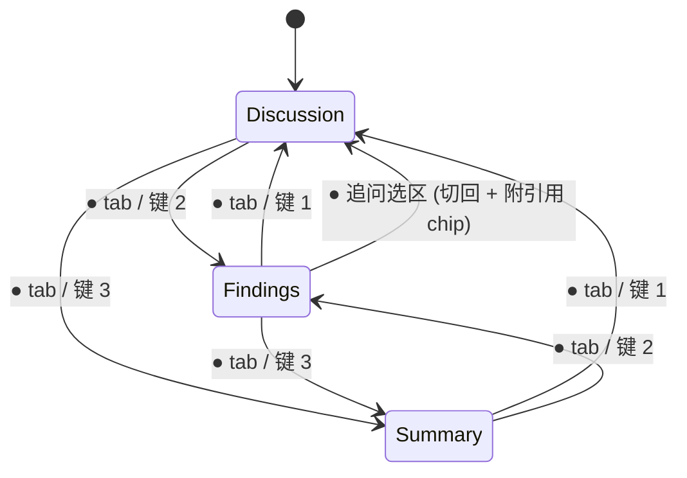

## finding:两组正交状态

finding 带两组**互相独立**的状态(见 [data-model](data-model.md)):**triage**(用户裁决保留/剔除)与 **submission**(是否已提交 GitHub)。二者正交 —— 一条 finding 的完整状态是 `(triage, submission)` 的组合;下面分开画,组合语义见其后表格。

### triage

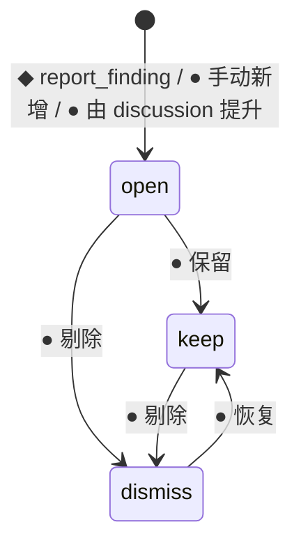

### submission

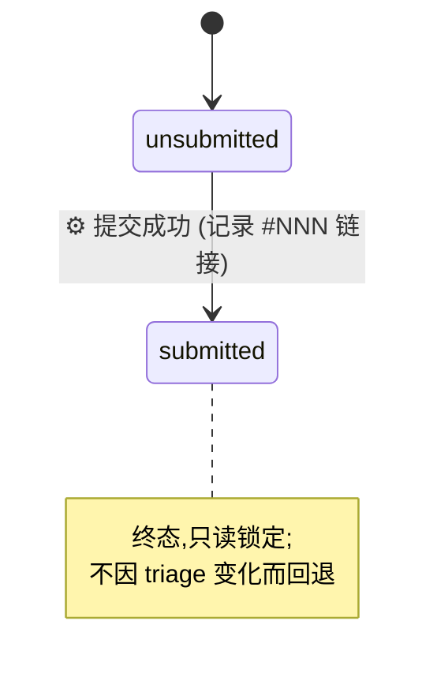

### 组合语义

只有 `keep` 的 finding 进入提交集;`submitted` 后回看是被动只读态,triage 不再影响它。UI 呈现按组合:

| (triage, submission) | 视觉(inline card / findings 行) |
| --- | --- |
| open, unsubmitted | 常规卡,待裁决 |
| keep, unsubmitted | 天蓝左条(保留),计入「提交 review · 保留 N 条」 |
| dismiss, unsubmitted | 虚线细条 + 删除线 + `↩ 恢复` |
| keep, submitted | 绿左条 `✓ 已提交 · #NNN`,只读锁定 |

## inline card 四态

diff 主区的内联 finding / discussion 卡在同一锚点处切换 view / edit / submitted / dismissed(见 ui.md「finding 就地编辑器」)。这是**呈现态**,与上面的 triage/submission **数据态**正交:edit 是临时编辑呈现,submitted / dismissed 呈现由数据态派生。

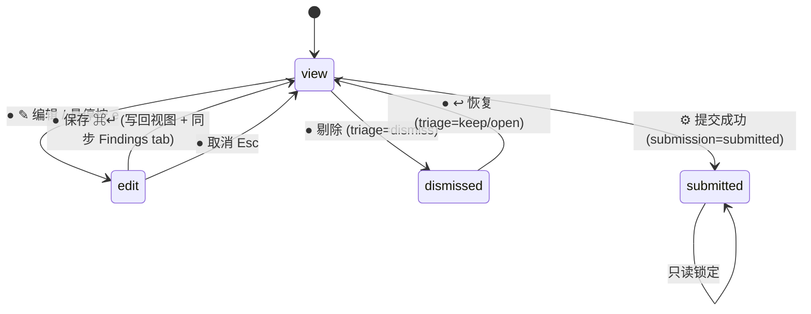

## Summary 正文就地编辑

Summary tab 的 codex 生成总结正文可就地编辑(是提交屏 review body 来源):

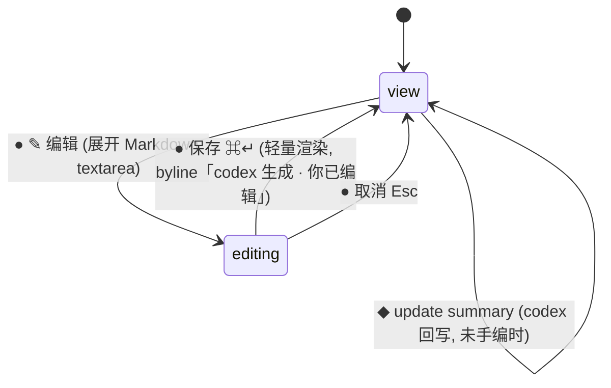

## diff 视图与覆盖

### unified / split 切换

file-header segmented 切换;键盘 `u` 直切。同一 hunk 保留两张 `.code` 表,内联卡共享不复制(见 ui.md「split vs unified」)。

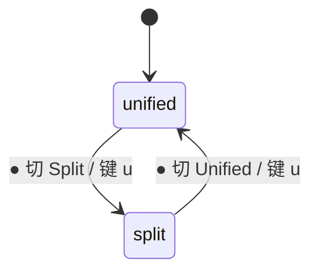

### per-file viewed

文件树每行 + diff file-header 的 viewed tick;标记后删除线 + 变灰 + 绿✓,并折叠该文件 diff。折叠(`⌄`)与 viewed 是两件事:`⌄` 仅折叠不改 viewed。

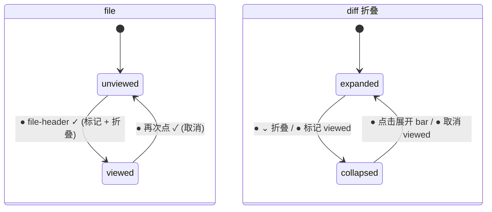

viewed 是**每 review 持久化**的 UI 状态(见 [frontend-components](frontend-components.md) 持久化节)。

## entry 空态 / 错误态

发起卡片的门槛态(`entry.html` 顶栏「预览态」切换)。分**硬错**(禁用 CTA)与**软警告**(放行):

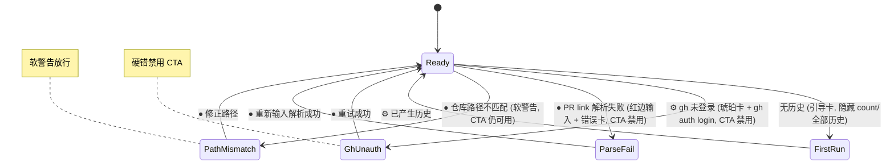

`local-branch` / `gitbutler-vbranch` 不需要 gh,`GhUnauth` 只作用于 `github-pr` source。

## 框选发起 discussion

diff 主区框选代码后浮出 popover,再决定发起 discussion(琥珀)或追问 codex(天蓝)。

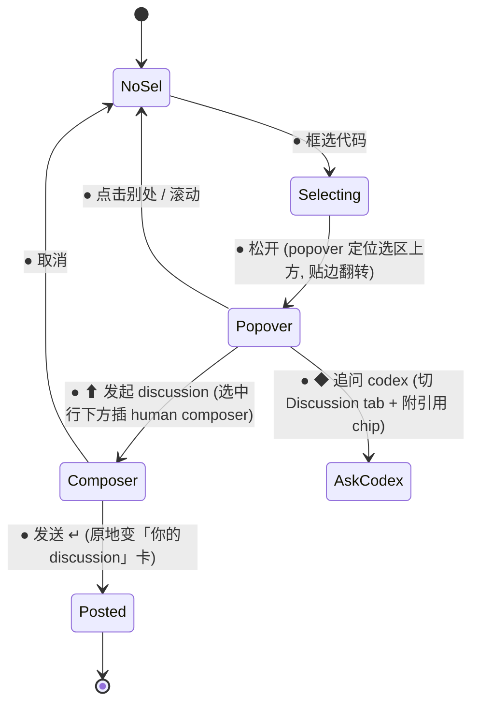

composer 的 `↳ 引用选区` chip 可移除;`@file` 弹文件菜单写入 `@path`(菜单本身是瞬态,选中即关)。

## 关联索引

- 视觉 / 交互细节:[ui.md](ui.md)
- 组件如何承载这些状态、哪些状态持久化:[frontend-components.md](frontend-components.md)
- finding 的 triage/submission 数据语义:[data-model.md](data-model.md) · [findings-submit.md](findings-submit.md)
